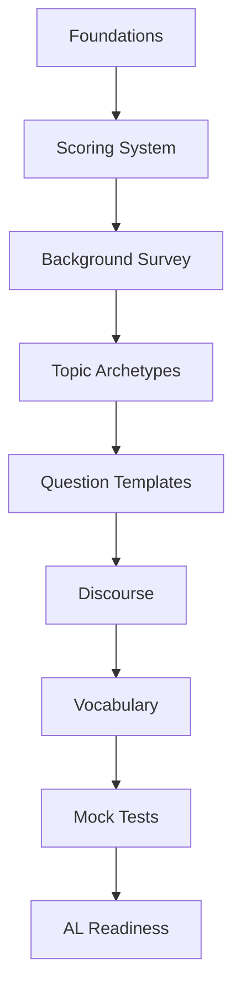

# Learning Path

> Repository: **The OPIc AL Bible**  
> Subtitle: *First Principles Handbook for Advanced Oral Proficiency*

---

# Learning Objectives

After completing this handbook, you should be able to:

- understand how the OPIc examination evaluates speaking ability
- identify the underlying mechanism behind every question
- organize responses using reusable discourse structures
- distinguish surface topics from core communication skills
- develop transferable speaking ability instead of memorized answers
- consistently perform at the Advanced Low (AL) level or above

---

# Prerequisites

Before beginning this repository, learners should:

- possess basic conversational English
- understand common daily-life vocabulary
- be willing to practice speaking aloud
- follow the lessons sequentially

No prior knowledge of OPIc is required.

---

# First Principle

**The OPIc test does not measure memorization.**

It measures whether a speaker can continuously construct meaningful spoken language under realistic communication conditions.

Therefore:

```
Speaking Ability
      >
Memorized Answers
```

Everything in this repository is built upon this principle.

---

# Why This Repository Exists

Many preparation books teach:

- topic answers
- vocabulary lists
- model responses

These resources often improve short-term performance but fail when:

- the question changes
- follow-up questions become unpredictable
- unfamiliar situations appear
- memorized scripts break down

This repository teaches the mechanism that generates those questions instead.

---

# Learning Philosophy

The learning process follows five principles.

## 1. First Principles

Understand why something works before learning techniques.

---

## 2. MECE Organization

Organize ideas into mutually exclusive, collectively exhaustive categories whenever practical.

---

## 3. System Thinking

Learn reusable systems instead of isolated examples.

---

## 4. Transferable Skills

Every framework should work across many topics.

---

## 5. Deliberate Practice

Improvement comes from structured repetition with feedback.

---

# Repository Architecture

```text
Foundations
        ↓
Scoring System
        ↓
Background Survey
        ↓
Topic Archetypes
        ↓
Question Templates
        ↓
Discourse Management
        ↓
Vocabulary
        ↓
Mock Tests
        ↓
Appendices
```

Each module depends on the previous one.

Skipping modules reduces learning efficiency.

---

# Recommended Study Process

For every lesson:

1. Read the learning objectives.
2. Understand the first principle.
3. Learn the core mechanism.
4. Study the framework.
5. Examine the examples.
6. Complete the exercises.
7. Finish the checklist.
8. Take the quiz.
9. Practice speaking aloud.
10. Continue only after mastering the current lesson.

---

# Decision Tree

```text
New Lesson
      │
      ▼
Understand Mechanism?
      │
 ┌────┴────┐
 │         │
No        Yes
 │         │
Review    Learn Framework
 │         │
 ▼         ▼
Practice Examples
      │
      ▼
Complete Exercises
      │
      ▼
Pass Quiz?
      │
 ┌────┴────┐
 │         │
No        Yes
 │         │
Review    Next Lesson
```

---

# Learning Timeline

| Stage | Goal |
|---------|------|
| Foundations | Understand the exam |
| Scoring | Learn evaluation criteria |
| Background Survey | Build personalized content |
| Topic Archetypes | Recognize question families |
| Question Templates | Predict question structures |
| Discourse | Improve coherence |
| Vocabulary | Increase expressive precision |
| Mock Tests | Simulate real exams |
| Review | Achieve consistent AL performance |

---

# Mermaid Overview



---

# Common Failure Modes

Learners often:

- memorize complete answers
- focus only on vocabulary
- ignore discourse organization
- skip foundational concepts
- practice without feedback
- study topics independently instead of recognizing patterns

---

# Best Practices

✅ Study sequentially.

✅ Speak aloud every day.

✅ Analyze mechanisms before examples.

✅ Reuse frameworks across multiple topics.

✅ Focus on consistency rather than perfection.

---

# Practice

Before moving to Lesson 01, answer the following questions.

1. Why does OPIc ask similar questions using different topics?

2. What is the difference between memorization and transferable speaking ability?

3. Why are frameworks more valuable than model answers?

4. Why should lessons be completed sequentially?

---

# Checklist

Before continuing, confirm that you can answer:

- [ ] What is the purpose of this repository?
- [ ] What is the first principle?
- [ ] Why is memorization insufficient?
- [ ] What are the major learning modules?
- [ ] What study process should be followed?

---

# Quiz

### Question 1

Which statement best describes the philosophy of this repository?

A. Memorize as many answers as possible.

B. Learn advanced vocabulary first.

C. Learn transferable speaking mechanisms.

D. Focus only on grammar accuracy.

**Answer:** C

---

### Question 2

Why are topic archetypes important?

A. They reduce vocabulary.

B. They reveal recurring question patterns.

C. They replace speaking practice.

D. They eliminate follow-up questions.

**Answer:** B

---

### Question 3

Which activity should occur after studying the framework?

A. Skip to the next lesson.

B. Memorize sample answers.

C. Practice speaking aloud.

D. Study vocabulary only.

**Answer:** C

---

# Summary

This lesson established the foundation for the entire repository.

The key idea is simple:

> Learn the mechanisms that generate successful speaking, not the answers themselves.

Every subsequent lesson builds on this principle.

---

# Next Lesson

**01 — Foundations**

Topics include:

- What OPIc actually measures
- Communication versus language knowledge
- Speaking as a decision-making process
- The anatomy of an AL-level response
- Mental models for effective oral proficiency

---
**End of Lesson**
